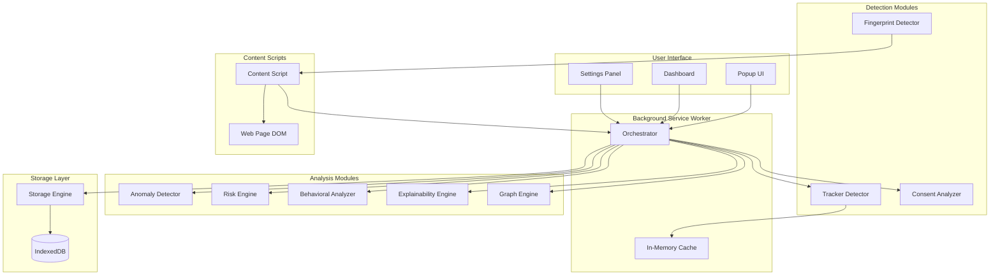
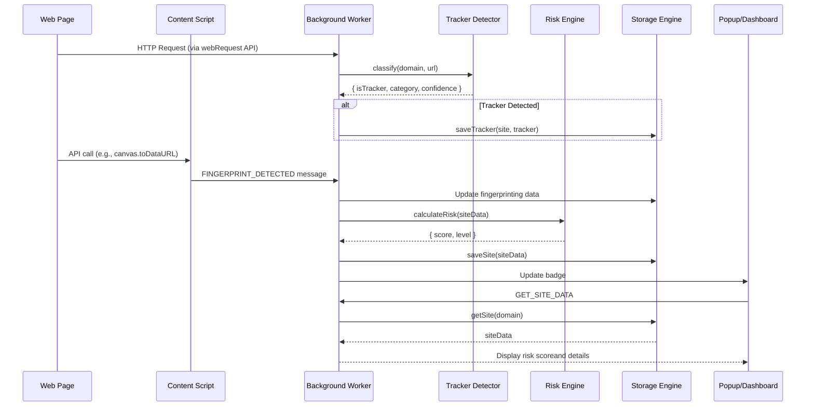

# PRIVISEE-X System Architecture

## Overview

PRIVISEE-X is a client-side privacy intelligence system built as a Chrome extension (Manifest V3). All processing happens locally with zero external dependencies.

## High-Level Architecture



## Component Descriptions

### 1. Background Service Worker

**Purpose**: Orchestrates all modules and handles network request interception

**Responsibilities**:
- Network request monitoring via `chrome.webRequest` API
- Cookie collection via `chrome.cookies` API
- Module coordination and data aggregation
- Message passing between content scripts and UI
- Badge updates with risk scores

**Key Files**:
- `background.js` - Main orchestrator

### 2. Content Scripts

**Purpose**: Injected into web pages to detect fingerprinting attempts

**Detection Methods**:
- Canvas API wrapping (`toDataURL`, `toBlob`)
- WebGL parameter queries
- AudioContext creation
- Font enumeration monitoring
- Battery API access
- Device memory/CPU queries
- WebRTC connection attempts

**Key Files**:
- `content.js` - Fingerprint detection wrappers

### 3. Storage Engine

**Technology**: IndexedDB with LRU caching

**Object Stores**:
- `sites` - Primary site metadata
- `trackers` - Tracker occurrences
- `graph` - Network graph data

**Indexes**:
- `sites`: by `domain`, `riskLevel`, `lastVisit`
- `trackers`: by `domain`, `category`

**Features**:
- Transaction batching
- Automatic cleanup (7-day retention)
- Query optimization with indexes

**Key Files**:
- `modules/storageEngine.js`

### 4. Detection Modules

#### 4.1 Tracker Detector

**Method**: Hybrid ML + Blocklist

**Features**:
- 500+ known tracker domains (blocklist)
- TensorFlow.js Random Forest classifier (ML fallback)
- Domain feature extraction (length, subdomain count, TLD analysis)
- Confidence scoring (0.0-1.0)
- Multi-category classification (advertising, analytics, social, fingerprinting)

**Algorithm**:
```javascript
if (domain in blocklist) {
  return { isTracker: true, source: 'blocklist', confidence: 1.0 }
} else if (mlModel) {
  features = extractFeatures(domain, url, context)
  prediction = mlModel.predict(features)
  return { isTracker: prediction.isTracker, source: 'ml', confidence: prediction.confidence }
} else {
  return { isTracker: false, source: 'unknown', confidence: 0.0 }
}
```

**Key Files**:
- `modules/trackerDetector.js`
- `data/tracker_blocklist.json`

#### 4.2 Fingerprint Detector

**Method**: API Wrapping

**Detected APIs**:
- Canvas: `toDataURL()`, `toBlob()`
- WebGL: `getParameter()` for VENDOR/RENDERER
- Audio: `createOscillator()`
- Fonts: `document.fonts.check()`
- Battery: `navigator.getBattery()`
- Device: `navigator.deviceMemory`, `navigator.hardwareConcurrency`
- WebRTC: `RTCPeerConnection` constructor

**Heuristics**:
- Canvas: Small size (\u003c100k pixels) + export = suspicious
- WebGL: Vendor/renderer queries = fingerprinting
- Audio: Multiple oscillator creations = fingerprinting
- Fonts: \u003e20 checks = enumeration

**Key Files**:
- `content.js`

#### 4.3 Consent Analyzer

**Method**: DOM Analysis + Pattern Matching

**Dark Patterns Detected**:
1. **Pre-checked boxes**: Optional tracking consent defaults to checked
2. **Visual prominence**: Accept button larger/more colorful than reject
3. **Deceptive language**: "Accept all" vs "Manage preferences"
4. **Hidden reject**: Reject button not visible or hard to find

**Scoring**:
- Pre-checked: +15 per checkbox
- Visual deception: +15 per issue
- Language deception: +10 per pattern
- Hidden reject: +20

**Key Files**:
- `modules/consentAnalyzer.js`

### 5. Analysis Modules

#### 5.1 Anomaly Detector

**Method**: Statistical (Isolation Forest variant)

**Algorithm**:
1. Calculate baseline statistics (last 100 sites):
   - Mean tracker count, cookie count, third-party connections
   - Standard deviation for each metric
2. For new site, calculate z-scores:
   ```
   z = (value - mean) / stdDev
   ```
3. Anomaly if |z| \u003e 2.5σ

**Features Analyzed**:
- Tracker count
- Cookie count
- Third-party domain count
- Fingerprinting attempts

**Key Files**:
- `modules/anomalyDetector.js`

#### 5.2 Risk Engine

**Method**: Adaptive Weighted Scoring

**Formula**:
```
Risk = Σ wi × fi(x)

where:
  wi = weight for feature i
  fi(x) = normalized feature value (0-1)
```

**Default Weights**:
- Tracker count: 0.25
- Cookies: 0.20
- Fingerprinting: 0.20
- Anomaly score: 0.10
- Third-party connections: 0.10
- HTTPS absence: 0.10
- Known malicious: 0.05

**Normalization**:
```javascript
normalizedTrackers = Math.min(trackerCount / 20, 1.0)
normalizedCookies = Math.min(cookieCount / 50, 1.0)
normalizedFingerprint = (canvas + webgl + audio + fonts) / 40
```

**Score Calibration**: Logarithmic scaling to 0-100

**Risk Levels**:
- Low: 0-25
- Moderate: 25-50
- High: 50-75
- Critical: 75-100

**Key Files**:
- `modules/riskEngine.js`

#### 5.3 Behavioral Analyzer

**Method**: Time-Series + Cross-Site Correlation

**Analyses**:

1. **Time-Series Trends**:
   - Linear regression on tracker/cookie counts over time
   - Detect significant changes (\u003e50% increase/decrease)
   - Flag anomalous evolution

2. **Cross-Site Correlation**:
   - Build tracker co-occurrence matrix
   - Identify trackers present on \u003e50% of sites
   - Calculate prevalence scores

3. **Profiling Detection**:
   - Persistent tracking (same trackers across sites)
   - Fingerprinting evolution (increasing fingerprint attempts)
   - Cookie syncing (multiple third-party cookie domains)

**Key Files**:
- `modules/behavioralAnalyzer.js`

#### 5.4 Explainability Engine

**Method**: SHAP-like Feature Attribution

**Process**:
1. Calculate marginal contribution of each feature
2. Generate natural language explanations
3. Provide actionable recommendations

**Example Output**:
```
"This site has a HIGH risk score (67) primarily because:
- 15 trackers detected (major contributor)
- 8 fingerprinting attempts (moderate contributor)  
- Anomaly detected: unusually high tracker count (minor contributor)

Recommendation: Use privacy-focused settings or consider blocking third-party trackers."
```

**Key Files**:
- `modules/explainabilityEngine.js`

#### 5.5 Graph Engine

**Method**: Network Analysis (PageRank)

**Graph Structure**:
- Nodes: Sites (blue) and Trackers (red)
- Edges: Site → Tracker connections

**Metrics**:
- **PageRank**: Identify hub trackers (high centrality)
- **Degree**: Connection count per node
- **Community Detection**: Tracker clusters

**Visualization**: D3.js force-directed layout

**Key Files**:
- `modules/graphEngine.js`

## Data Flow

### Typical Request Flow



## Message Passing Protocol

### Background ← Content Script

```javascript
{
  type: 'FINGERPRINT_DETECTED',
  data: {
    canvas: 3,
    webgl: 2,
    audio: 1,
    fonts: 25,
    timestamp: 1709876543210
  }
}
```

### Background ← UI (Popup/Dashboard)

```javascript
// Get site data
{
  type: 'GET_SITE_DATA',
  domain: 'example.com'
}

// Get all sites
{
  type: 'GET_ALL_SITES',
  limit: 100
}

// Get graph
{
  type: 'GET_GRAPH'
}

// Clear data
{
  type: 'CLEAR_ALL'
}
```

### Background → UI

```javascript
{
  success: true,
  data: {
    domain: 'example.com',
    riskScore: 67,
    riskLevel: 'High',
    trackerCount: 15,
    cookieCount: 23,
    fingerprinting: { canvas: 3, webgl: 2 },
    explanation: '...',
    anomaly: { isAnomalous: true }
  }
}
```

## Performance Optimizations

1. **In-Memory Cache**: Active site data cached in Map for O(1) access
2. **IndexedDB Indexes**: Fast queries on domain, risk level, last visit
3. **Batch Operations**: Minimize transaction overhead
4. **Lazy Loading**: Dashboard loads data on-demand
5. **Throttling**: Fingerprint detection reports max once per second
6. **Web Worker**: Consider offloading ML inference (future)

## Security Considerations

1. **No External API Calls**: All processing is local
2. **No Telemetry**: Zero data collection or reporting
3. **Sandboxed Storage**: IndexedDB isolated to extension
4. **Content Script Isolation**: Runs in isolated world
5. **CSP**: Content Security Policy prevents XSS

## Privacy Guarantees

1. **Local-Only Processing**: All ML inference runs in browser
2. **Automatic Cleanup**: Data deleted after 7 days (configurable)
3. **No Cross-Site Tracking**: Extension does not track user behavior
4. **Optional Federated Learning**: Opt-in only, with differential privacy

## Scalability

- **Sites**: Tested with 1000+ sites
- **Trackers**: Handles 500+ unique trackers
- **Graph**: Efficient up to 10,000 nodes
- **Memory**: Target \u003c100MB, typical ~60MB
- **CPU**: Target \u003c3% active, \u003c1% idle

## Future Enhancements

1. **TensorFlow.js Models**: Deploy trained Random Forest
2. **Advanced Graph Algorithms**: Community detection, clustering
3. **Real-Time Blocking**: Active tracker blocking (requires permissions)
4. **Export/Import**: Complete data portability
5. **Federated Learning**: Collaborative model improvement
